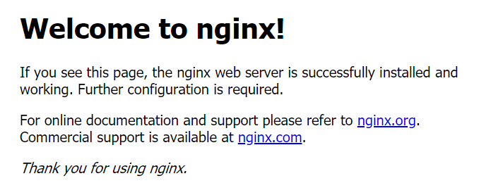
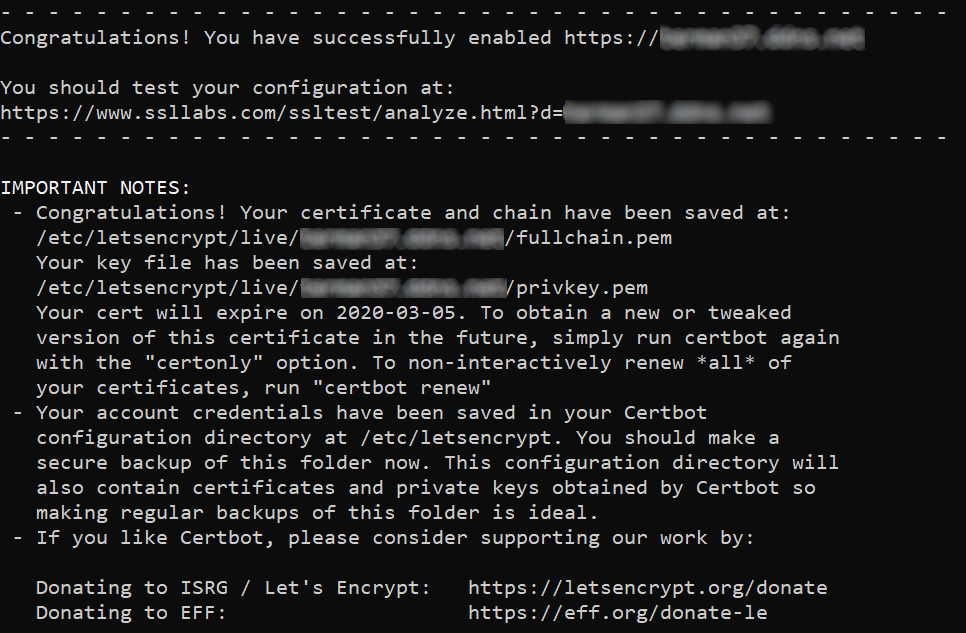

# Home reverse proxy setup

## Main Idea

Setup a reverse proxy to gain access to: 

- My synology NAS *(without quickconnect)*
  - DSM
  - Moments
  - Surveillance station
  - Web station
  - Others services... (TBD)

- Home Automation Web server Jeedom *(without using included OpenVPN)*
- My Router config Page (Asus RT-AC68)
- My ISP Router
- Others (maybe create interface to add/remove/edit proxy settings)

via `https://<my domain>.ddns.net/path_to_service`

## Config

- Dyndns already created (today on ISP router)
  - Move to RPI ? ddclient - TBD
- Reverse proxy will run on an unused Raspberry Pi

- Connection to anywhere has to be done through TLS encrypted https: 
  - target CryptCheck A or A+

- SSL/TLS certificates from Let's encrypt and renewed automatically

## Initial Config (Rpi - routers)

As i'm not at home for now, all config should be able to be done remotely

Initial steps to be able to work remotely:

- Setup a functional Raspberry Linux version (Raspbian **Lite**)
  - https://www.raspberrypi.org/downloads/ 
  
  - Create SD card using [BalenaEtcher](https://www.balena.io/etcher/)
  
  - create **ssh** file ('no extension') on the boot partition
  
  - Connect in ssh with default credentials: pi / raspberry 
  
    ```bash
    ssh <USERNAME>@<PI ip>
    ```
  
  - change password: 
  
    ```bash
    passwd
    ```
  
  - On **your** computer [generate](https://www.raspberrypi.org/documentation/remote-access/ssh/passwordless.md) ssh key-pair for remote connection (easier) 
  
    ```bash
    ssh-keygen
    ```
  
  -  key is generated in ~/.ssh/ named id_rsa (private key) and id_rsa_pub (public key to be copied to RPi)
  
  -  Copy id to RPI
  
     ```bash
     ssh-copy-id <USERNAME>@<IP-ADDRESS>
     ```
  
  -  Backup private key (just in case)
  
     ```bash
     cp ~/.ssh/id_rsa ~/<keyname.pem>
     ```
  
  - Disable ssh authentication by password on Rpi
  
    - Connect using key
  
    ```bash
    ssh -i <keyname.pem> <USERNAME>@<IP-ADDRESS>
    ```
  
    - Edit sshd_config
  
    ```bash
    sudo nano /etc/ssh/sshd_config
    ```
    
  - Uncomment and set to no, the line:
    
  ```bash
    # To disable tunneled clear text passwords, change to no here!
    PasswordAuthentication no
  ```
  
    -  Restart ssh service
  
    ```bash
     sudo service ssh restart
    ```
  
- On ISP router:
  
  - Bind Internal router MAC address to <RouterIP> 
  - Place <RouterIP> in DMZ
  
- On internal router:
  
  - Bind RPI MAC address to <RPI IP> 
  - redirect 22 to <RPI IP>:22

- Check if remote access to Raspberry is working

- Check if remote access to my router is working ( just in case - if I need to fine tune settings)

## Install Nginx

Inspired by this [article](https://engineerworkshop.com/2019/01/16/setup-an-nginx-reverse-proxy-on-a-raspberry-pi-or-any-other-debian-os/)

- Update packages

  ```bash
  sudo apt-get update
  sudo apt-get upgrade
  ```

- Install Nginx

  ```bash
  sudo apt-get install nginx
  ```

- Check if Nginx is running, by going in web browser to <local RPI IP>

  
  

## Redirect traffic to Reverse proxy

- On internal router
  - forward port 80 and 443 to <Local RPi IP>

## Install certbot for SSL certificates

- Install [certbot](https://certbot.eff.org/lets-encrypt/debianbuster-nginx)

  ```bash
  sudo apt-get install certbot python-certbot-nginx
  ```

- Run certbot for Nginx for <yourdomain.com> 

  ```bash
  sudo certbot --nginx -d <yourdomain.com>
  ```
  
  - enter email
  - Agree terms of service
  - Select  whether or not to redirect HTTP traffic to HTTPS
  
  
  
- ssllabs.com --> Grade A

## Configure Nginx:

1. Use the Let's Encrypt HTTPS certificates provided by certbot.
2. Automatically redirect HTTP to HTTPS
3. Close connections for any subdomains we're not trying to proxy

- backup default config

```bash
sudo cp /etc/nginx/sites-available/default ~/nginx-default.bak
```

- Edit default config, replace content with this:
  - redirect http to https
  - disable https nginx default web server

```bash
sudo nano /etc/nginx/sites-available/default 
```

```nginx
# Default HTTP server -> redirect to HTTPS
server {
    listen 80 default_server;
    listen [::]:80 default_server;
    server_name _;
    return 301 https://$host$request_uri;
}

# Default HTTPS server (just disconnect)
server {
    listen [::]:443 ssl ipv6only=on; # managed by Certbot
    listen 443 ssl; # managed by Certbot

    ssl_certificate /etc/letsencrypt/live/<yourdomain.com>/fullchain.pem; # managed by Certbot
    ssl_certificate_key /etc/letsencrypt/live/<yourdomain.com>/privkey.pem; # managed by Certbot
    include /etc/letsencrypt/options-ssl-nginx.conf; # managed by Certbot
    ssl_dhparam /etc/letsencrypt/ssl-dhparams.pem; # managed by Certbot

    server_name _;
    
    if ($request_method !~ ^(GET|HEAD|POST)$ ) {
    return 444;
    }
    return 444;
}
```

- Configure redirections:

  - Create and edit new configuration file

    ```bash
    sudo nano /etc/nginx/sites-available/<yourdomain.com>.conf
    ```

  - Edit Nginx config file to look like this: 

```nginx
server {
    
        listen 443 ssl;

        ssl_certificate /etc/letsencrypt/live/<yourdomain.com>/fullchain.pem;
    	ssl_certificate_key /etc/letsencrypt/live/<yourdomain.com>/privkey.pem;
    	include /etc/letsencrypt/options-ssl-nginx.conf; 
        ssl_dhparam /etc/letsencrypt/ssl-dhparams.pem; 
        
    	server_name <yourdomain.com>;
    
        location /website1/ {
                index index.php;
                proxy_pass http://192.168.xx.xx:80/path/;
        }
        location /phpmyadmin/ {
                proxy_pass http://192.168.xx.xx:80/phpMyAdmin;
        }
        location /jeedom/ {
                root /var/www/hmtl/;
                index index.php;
                proxy_pass http://192.168.xx.xx:80/;
        }
		location /dsm {
                index index.cgi;
                rewrite ^/dsm/(.*)$ /$1 break;
                proxy_set_header Host $host;
                proxy_set_header X-Forwarded-For $proxy_add_x_forwarded_for;
                proxy_set_header X-Real-IP $remote_addr;
                proxy_pass http://192.168.xx.xx:5000/;
        }
        location /router {
                proxy_pass "http://192.168.x.xx:xxxx/";
        }
}      
```

- Link config file

```bash
sudo ln -s /etc/nginx/sites-available/<yourdomain.com>.conf /etc/nginx/sites-enabled/<yourdomain.com>.conf
```

- Test config files syntax

```bash
sudo nginx -t
```

- Reload Nginx configuration files:

```bash
sudo nginx -s reload
```

## 


Add common headers to be included always:

```bash
sudo nano /etc/nginx/conf.d/proxy.conf
```

filled with

```nginx
proxy_redirect off;
proxy_set_header Host $host;
proxy_set_header X-Real-IP $remote_addr;
proxy_set_header X-Forwarded-For $proxy_add_x_forwarded_for;
proxy_hide_header Strict-Transport-Security;
proxy_hide_header X-Powered-By;
proxy_hide_header *;
proxy_intercept_errors on;
proxy_buffering on;
proxy_cache_key "$scheme://$host$request_uri";
proxy_cache_path /var/cache/nginx levels=1:2 keys_zone=cache:10m inactive=7d max_size=700m;
```

## Manage Dynamic DNS from RPi (instead of ISP router)


- TBD


## Tips

- Raspberry Pi

  - Shutdown the raspberry pi

    ```bash
    sudo shutdown -h now
    ```

- Nginx

  - check which version is running:

    ```bash
    nginx -v
    ```

  - check error log file

    ```bash
    cat /var/log/nginx/error.log
    ```

- Certbot
  - Test certificate renewal 

    ```bash
    sudo certbot renew --dry-run
    ```

  - Certificate renewal when needed
  
    ```bash
    sudo certbot renew
    ```
  
    


