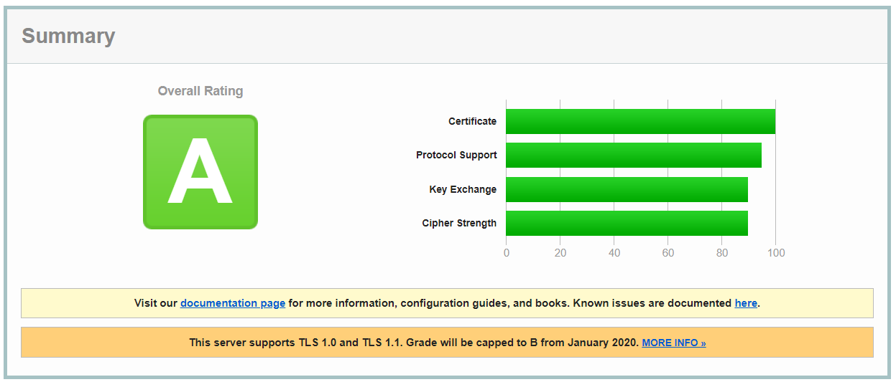
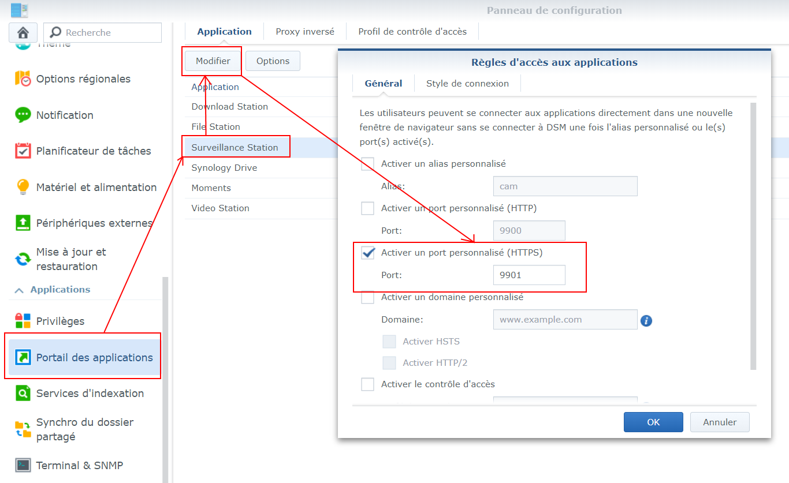
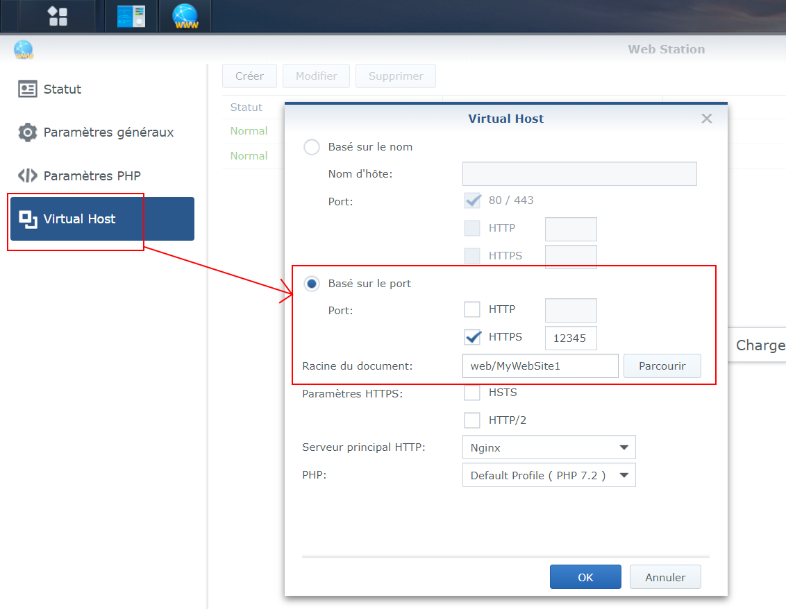

# Nginx-Reverse-Proxy Home-Setup

## Main Idea

**Setup a reverse proxy** to gain access to: 

- My synology NAS *(without quickconnect)*
  - DSM
  - Moments
  - Surveillance station
  - Web station
- Home Automation Web server Jeedom *(without using included OpenVPN)*
- Personal website (php/js / MariaDB) hosted on NAS
- Others (maybe create interface to add/remove/edit proxy settings)

via `https://<my domain>/path_to_service`

**Constraints:**

- run on an unused Raspberry Pi B+
- Connection to anywhere has to be done through TLS encrypted https: 
  - target SSL Labs A or A+
- SSL/TLS certificates from Let's encrypt and renewed automatically

## Initial Config (Rpi - routers)

As i'm not at home for now, all config should be able to be done remotely

Initial steps to be able to work remotely:

- Setup a functional Raspberry Linux version (Raspbian **Lite**)
  - https://www.raspberrypi.org/downloads/ 
  
  - Create SD card using [BalenaEtcher](https://www.balena.io/etcher/)
  
  - create **ssh** file ('no extension') on the boot partition
  
  - Connect in ssh with default credentials: pi / raspberry 
  
    ```bash
    ssh <USERNAME>@<PI ip>
    ```
  
  - change password: 
  
    ```bash
    passwd
    ```
  
  - On **your** computer [generate](https://www.raspberrypi.org/documentation/remote-access/ssh/passwordless.md) ssh key-pair for remote connection (easier) 
  
    ```bash
    ssh-keygen
    ```
  
  -  key is generated in ~/.ssh/ named id_rsa (private key) and id_rsa_pub (public key to be copied to RPi)
  
  -  Copy id to RPI
  
     ```bash
     ssh-copy-id <USERNAME>@<IP-ADDRESS>
     ```
  
  -  Backup private key (just in case)
  
     ```bash
     cp ~/.ssh/id_rsa ~/<keyname.pem>
     ```
  
  - Disable ssh authentication by password on Rpi
  
    - Connect using key
  
    ```bash
    ssh -i <keyname.pem> <USERNAME>@<IP-ADDRESS>
    ```
  
    - Edit sshd_config
  
    ```bash
    sudo nano /etc/ssh/sshd_config
    ```
    
  - Uncomment and set to no, the line:
    
    ```bash
    # To disable tunneled clear text passwords, change to no here!
    PasswordAuthentication no
    ```
  
    -  Restart ssh service
  
    ```bash
     sudo service ssh restart
    ```
  
- On ISP router:
  
  - Bind Internal router MAC address to <RouterIP> 
  - Place <RouterIP> in DMZ
  
- On internal router:
  
  - Bind RPI MAC address to <RPI IP> 
  - redirect port 22 to <RPI IP>:22 (for remote setup)


## Install Nginx

- Update packages

  ```bash
  sudo apt-get update
  sudo apt-get upgrade
  ```

- Install Nginx

  ```bash
  sudo apt-get install nginx
  ```

- Check if Nginx is running, by going in web browser to <local RPI IP>

  
  

## Redirect traffic to Reverse proxy

- On internal router
  - forward port 80 and 443 to <Local RPi IP>

## Install certbot for SSL certificates

- Install [certbot](https://certbot.eff.org/lets-encrypt/debianbuster-nginx)

  ```bash
  sudo apt-get install certbot python-certbot-nginx
  ```

- Run certbot for Nginx for <yourdomain.com> 

  ```bash
  sudo certbot --nginx -d <yourdomain.com>
  ```
  
  - enter email
  - Agree terms of service
  - Select  whether or not to redirect HTTP traffic to HTTPS
  
  
  
- ssllabs.com --> Grade A

  

- improve SSL security:

  ```bash
  sudo nano /etc/letsencrypt/options-ssl-nginx.conf
  ```

  - modify line as follow:

    ```nginx
    # Allow only TLS 1.2;
    #ssl_protocols TLSv1 TLSv1.1 TLSv1.2;
    ssl_protocols TLSv1.2;
    
    # Change to more recommended ciphers
    #ssl_ciphers "ECDHE-ECDSA-CHACHA20-POLY1305:ECDHE-RSA-CHACHA20-POLY1305:ECDHE-ECDSA-AES128-GCM-SHA256:ECDHE-RSA-AES128-GCM-SHA256:ECDHE-ECDSA-AES256-GCM-SHA3$
    
    ssl_ciphers ECDHE-RSA-AES256-GCM-SHA512:DHE-RSA-AES256-GCM-SHA512:ECDHE-RSA-AES256-GCM-SHA384:DHE-RSA-AES256-GCM-SHA384:ECDHE-RSA-AES256-SHA384;
    ```

## Configure Synology vHosts:

- For synology apps:

  

- For Webstation:

  

## Configure Nginx:

- Configure redirections:

  - Create and edit new configuration file

    ```bash
    sudo nano /etc/nginx/sites-available/<yourdomain.com>.conf
    ```

  - Edit Nginx config file to look like this: 

    ```nginx
    # Default HTTP server -> redirect to HTTPS
    server {
        listen 80 default_server;
        listen [::]:80 default_server;
        server_name <yourdomain.com>;
        return 301 https://$host$request_uri;
    }
    server {
    	listen 443 ssl;
    	listen [::]:443 ssl;

        ssl_certificate /etc/letsencrypt/live/<yourdomain.com>/fullchain.pem;
        ssl_certificate_key /etc/letsencrypt/live/<yourdomain.com>/privkey.pem;
        include /etc/letsencrypt/options-ssl-nginx.conf;
        ssl_dhparam /etc/letsencrypt/ssl-dhparams.pem;

        server_name <yourdomain.com>;

        location /cpts/ {
            index index.php index.html;
            proxy_pass http://192.168.xx.xx:10001/;
        }
        location /php/ {
            index index.php;
            proxy_pass https://192.168.xx.xx:10010/;
        }
        location /moments/ {
            proxy_pass https://192.168.xx.xx:10005/;
        }
        location /drive/ {
            proxy_pass https://192.168.xx.xx:10003/;
        }
        location /surveillance/ {
            proxy_pass https://192.168.xx.xx:9901/;
        }
        location /dsm/ {
            proxy_pass https://192.168.xx.xx:5001/;
        }
        location /jeedom/ {
            root /var/www/html/;
            index index.php;
            proxy_pass http://192.168.xx.xx:80/;                                   
        }
        
        # Close connections for any other subdomains
        location / {
            return 444;
    }
    }
    ```
  
- Link config file

  ```bash
  sudo ln -s /etc/nginx/sites-available/<yourdomain.com>.conf /etc/nginx/sites-enabled/<yourdomain.com>.conf
  ```

- Edit Nginx config (to disable default config file):

  ```bash
  sudo nano /etc/nginx/nginx.conf
  ```

  - modify line:

    ```nginx
    include /etc/nginx/sites-enabled/*;
    ```

  - to: (so, it will not use anymore default file named "default") 

    ```nginx
    include /etc/nginx/sites-enabled/*.conf;
    ```

- Test new configuration

  ```bash
  sudo nginx -t
  ```

- Reload Nginx configuration files:

  ```bash
  sudo nginx -s reload
  ```

  

## Tips

- Raspberry Pi

  - Shutdown the raspberry pi

    ```bash
    sudo shutdown -h now
    ```

- Nginx

  - check which version is running:

    ```bash
    nginx -v
    ```

  - check error log file

    ```bash
    cat /var/log/nginx/error.log
    ```

- Certbot
  - Test certificate renewal 

    ```bash
    sudo certbot renew --dry-run
    ```

  - Certificate renewal when needed
  
    ```bash
    sudo certbot renew
    ```
  
    


